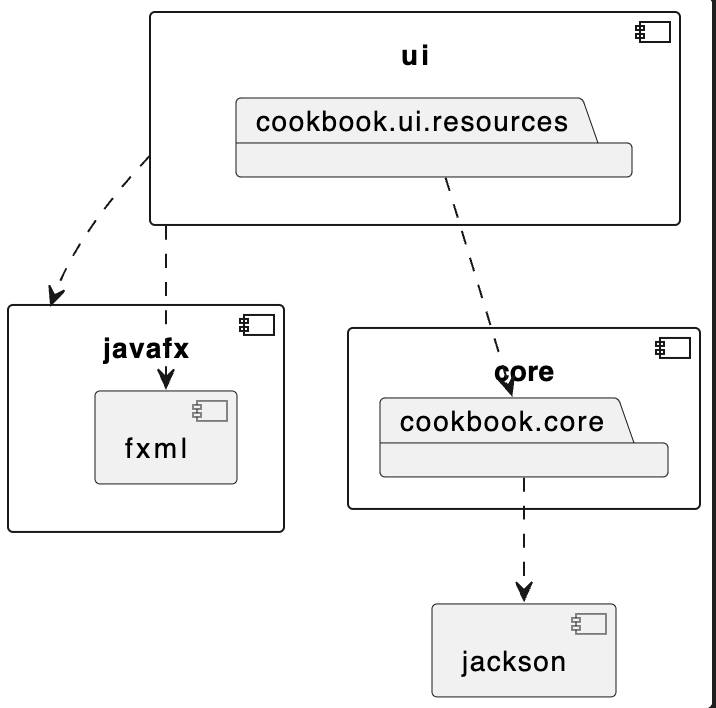
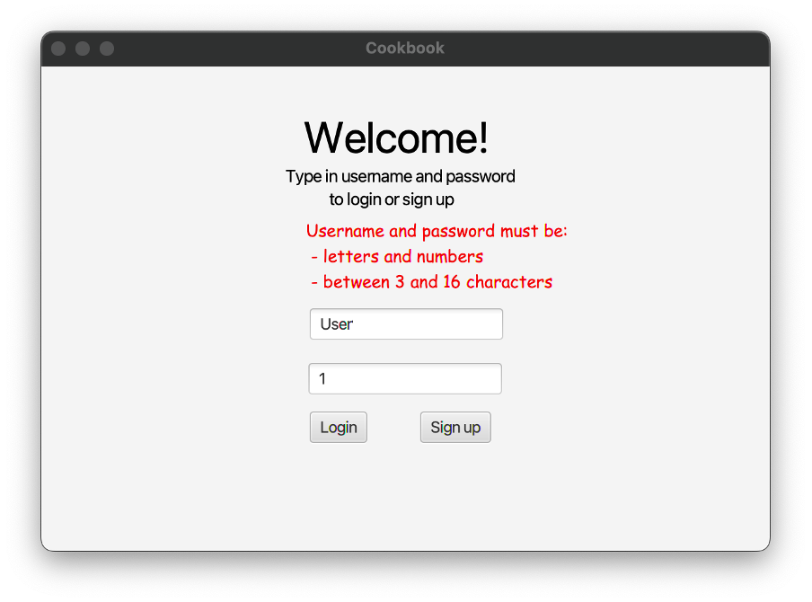
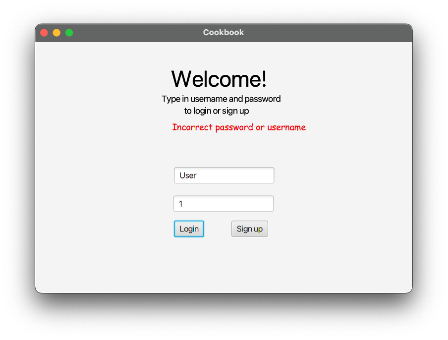
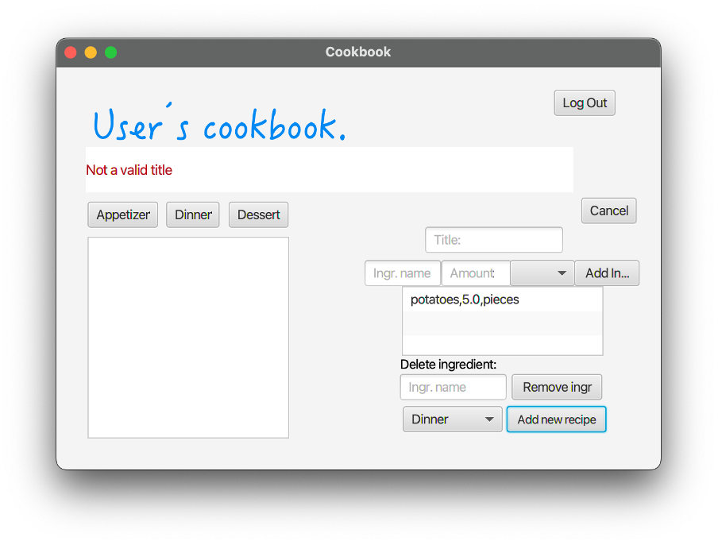
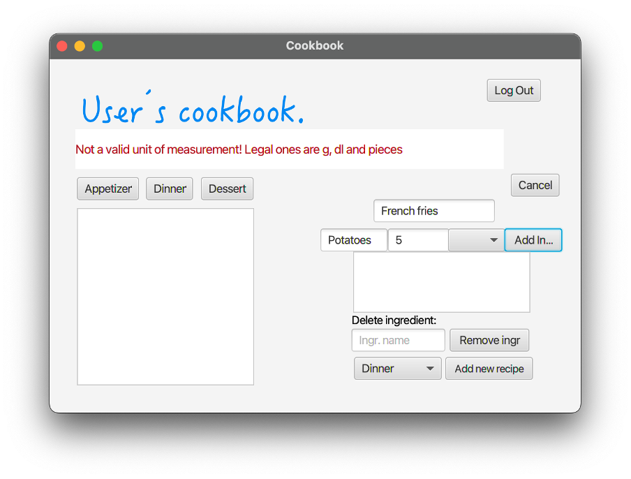

# Release 2

## Application Functionality
 
- Login or signup
 - Look at all your recipes
 - Filter your recipes based on category
 - Add recipe
 - Get random recipe
 - Remove recipe
 - Log out

## Architecture Diagram
The PlantUML diagram is representing the architecture of the application.

The diagram can be previewed i Visual Studio Code if you install the extantion PlantUML. 
The official website: https://www.plantuml.com/plantuml

You also need to install Graphviz. Go to https://graphviz.org/download/ for instructions on how to download on your computer. 

**architecture.puml**

For description of what the packages contains, view 
[README.md](README.md).
### The interactions between the packages
[core](cookbook/core/src/main/java/core) may interact with the external librarie as Jackson, for data processing with JSON. 

[ui](cookbook/ui) relies on the javafx component for creating the graphical interface. It will also interact with core, to fetch and display data from the logic.

The javafx component is essential when creating the graphical UI. It will load UI resources from the [ui](cookbook/ui) package.

This architecture separates the core logic, user interface, and data handling components. It allows flexible development, and makes it easier to update or replace specific parts of the system without affecting the entire Cookbook application.

 ## Screenshots

 ### General Functionality  
We have not changed much on the interface. See comments before each picture for possible changes

**Login**  
Moved the boxes further down to make room for potenial error message

**CookBook**  
Changed the font and added a box to type in which recipe you want to delete

**Add Recipe**  
Changed the unit-chooser to a dropdown-box instead of a text box. 

**Random Recipe**

 ### Pop-up error messages

 **Login**  
 Username or password not meeting criterias
  
Username or Password incorrect

**Adding Recipe**  
Adding Recipe without filling in the title

Adding Recipe without setting the category
Adding Recipe without filling in any ingrediens

**Adding Ingredient**  
Adding ingredient without setting the unit

Adding ingredient without setting amount
Adding ingredient without writing the name of the ingredient.  
**Removing**  
Removing a recipe that does not exist  
Removing an ingredient that is not in the list

